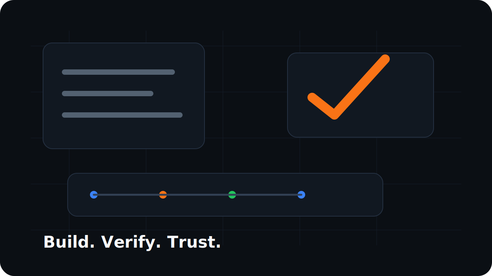
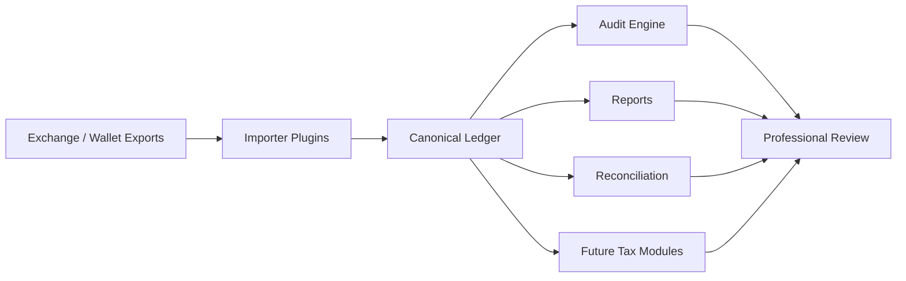

<div align="center">


<br>

# Reckonry

### Build. Verify. Trust.

**Open-source infrastructure for verifiable financial ledgers.**

*Reconstruct. Normalize. Audit. Reconcile. Report.*

<br>


<br>

> **Engineering trust through verifiable financial infrastructure.**

</div>

Reckonry imports fragmented digital asset source data, preserves evidence, reconstructs a canonical ledger, and generates reproducible review artifacts for accountants, auditors, developers, and finance teams.

Reckonry does not calculate taxes. It builds trust.

Every imported byte must remain traceable. Every generated number must be explainable. Unknown data is preserved instead of hidden. The ledger is the single source of truth.

## Quickstart

Run the full public demo with synthetic data:

```bash
dotnet build Reckonry.sln
dotnet test Reckonry.sln
scripts/demo.sh
```

On Windows PowerShell:

```powershell
dotnet build Reckonry.sln
dotnet test Reckonry.sln
./scripts/demo.ps1
```

The demo reads fake inputs from [samples/demo](samples/demo/README.md) and writes generated outputs to ignored local files under `artifacts/demo/`, including `ledger.json`, audit reports, reconciliation summary, Italy RW accountant package, and Tax Dossier PDF.

See [docs/quickstart.md](docs/quickstart.md) for the full 10-minute walkthrough.

## Why Reckonry Exists

Digital asset accounting breaks when source data is treated as disposable. Exchanges change schemas, split activity across products, rename operations, and export files that are hard to reconcile months later.

Reckonry treats source evidence as part of the system, not a temporary import detail. Importers produce canonical ledger events. Reports, reconciliation tools, and future tax modules consume the ledger without modifying it.

## Core Principles

<table>
  <tr>
    <td> <strong>Never invent financial data</strong><br>Missing values remain missing until supported by evidence.</td>
    <td> <strong>Preserve every source</strong><br>Rows, files, and source references remain traceable.</td>
  </tr>
  <tr>
    <td> <strong>Make every number explainable</strong><br>Reports must be reproducible from the ledger.</td>
    <td> <strong>Ledger first</strong><br>Tax modules interpret the ledger. They never modify it.</td>
  </tr>
</table>

See [docs/philosophy.md](docs/philosophy.md), [docs/engineering/principles.md](docs/engineering/principles.md), and [docs/development/definition-of-done.md](docs/development/definition-of-done.md).

## Product Surface

<table>
  <tr>
    <td><strong>Canonical Ledger</strong><br>Source-preserving digital asset event model.</td>
    <td><strong>Importer Plugins</strong><br>Exchange-specific parsing behind stable contracts.</td>
    <td><strong>Audit Reports</strong><br>Integrity checks, warnings, and reproducible evidence.</td>
  </tr>
  <tr>
    <td><strong>Reconciliation</strong><br>Compare Reckonry outputs against official reports.</td>
    <td><strong>Tax Dossier</strong><br>Professional review package, not a filing engine.</td>
    <td><strong>SDK Architecture</strong><br>Importer, report, reconciliation, and tax extension points.</td>
  </tr>
</table>

<div align="center">
  
  <p><sub>Preview placeholder: product-grade report and verification surfaces are evolving.</sub></p>
</div>

## Architecture



Project boundaries:

- `Reckonry.Core` contains canonical ledger models and never references importers or tax modules.
- Importers produce ledger events.
- Reports consume ledger events.
- Reconciliation is read-only.
- Tax modules consume the ledger only.
- Decimal arithmetic is used for financial and digital asset quantities.

Architecture decisions are tracked in [docs/adr](docs/adr/README.md).

## Canonical Ledger

Reckonry writes `ledger.json` using the Reckonry canonical ledger v1 format.

- Specification: [docs/specifications/reckonry-ledger-v1.md](docs/specifications/reckonry-ledger-v1.md)
- JSON schema: [reckonry.schema.json](reckonry.schema.json)
- Schema version: `reckonry-ledger-v1`

The CLI validator returns `PASS` for valid canonical ledgers or a list of validation errors.

## CLI

```bash
reckonry importers
```

```bash
reckonry import binance --input ./input/binance --out ./output/ledger.json
```

```bash
reckonry validate --input ./output/ledger.json
```

```bash
reckonry audit --input ./output/ledger.json --out ./output/audit
```

```bash
reckonry report rw-snapshot --input ./output/ledger.json --year 2025 --out ./output/reports
```

```bash
reckonry report italy-rw-accountant --input ./output/ledger.json --year 2025 --out ./output/accountant --language it-IT
```

```bash
reckonry report tax-dossier --year 2025 --ledger ./output/ledger.json --handoff ./output/accountant/accountant-handoff-2025.json --rw ./output/accountant/italy-rw-accountant-2025.json --out ./output/accountant --language en-US
```

Italy RW accountant and Tax Dossier reports support `it-IT` and `en-US`. Italy RW outputs default to `it-IT`. Legal field codes such as `RW`, `RW8`, `IC`, `IVAFE`, and `IVIE`, asset symbols, hashes, and source file names are not translated.

## Tax Dossier

The Tax Dossier is a professional review PDF for accountants, auditors, and tax professionals.

It includes:

- Cover page and verification QR code.
- Ledger integrity summary.
- Reconciliation status.
- Source document summary.
- Portfolio composition chart based only on available valuation evidence.
- Movement timeline using monthly event counts only.
- RW/RW8 draft sections.
- Validation errors and missing inputs.
- Professional checklist.
- Technical appendix with hashes, version, commit, and aggregate counts.

The Tax Dossier is not a tax filing and does not provide tax, legal, accounting, or financial advice.

## Verification & Reconciliation

Reckonry can compare internally reconstructed reports against official exchange-issued reports for validation. Reconciliation never replaces the ledger and never changes ledger events.

```bash
reckonry reconcile binance --reports ./input/binance --ledger-reports ./output/reports --out ./output/reconciliation
```

For Binance Italy documents, Reckonry reads text-based Tax Certification PDFs and Annual Balance Report PDFs when text can be extracted directly. Image-only PDFs are detected and reported as requiring OCR.

## Plugin Ecosystem

Reckonry is designed for exchange-independent and country-independent growth.

| Area | Contract | Purpose |
| --- | --- | --- |
| Importers | `IExchangeImporter` | Convert source exports into canonical ledger events. |
| Reports | Report SDK | Generate reproducible artifacts from the ledger. |
| Reconciliation | Reconciliation SDK | Compare ledger outputs with external official reports. |
| Tax | Tax SDK | Interpret the ledger without modifying it. |
| Pricing | Pricing abstractions | Future evidence-backed market data integrations. |

SDK design notes live in [docs/sdk](docs/sdk/README.md).

## Supported Importers

| Importer | Plugin Id | Status | Version | Coverage |
| --- | --- | --- | --- | ---: |
| Binance | `binance` | Early implementation | `0.1.0` | 70% |
| Coinbase | `coinbase` | Placeholder plugin | `0.0.0-placeholder` | 0% |
| Kraken | `kraken` | Placeholder plugin | `0.0.0-placeholder` | 0% |
| Revolut | `revolut` | Placeholder plugin | `0.0.0-placeholder` | 0% |
| Crypto.com | `crypto.com` | Placeholder plugin | `0.0.0-placeholder` | 0% |
| Bitstamp | `bitstamp` | Placeholder plugin | `0.0.0-placeholder` | 0% |

Unsupported rows are intentionally preserved as unknown ledger events instead of being discarded.

## API Preview

`Reckonry.Api` is a Minimal API architecture preview for in-memory workflows. It has no authentication, no database, and no persistent storage.

```bash
dotnet run --project src/Reckonry.Api/Reckonry.Api.csproj
```

Endpoints:

- `POST /import`
- `POST /audit`
- `POST /reports`
- `POST /reconcile`
- `GET /importers`
- `GET /swagger/v1/swagger.json`

## Roadmap

See [ROADMAP.md](ROADMAP.md) for planned milestones from `v0.1.0-alpha` through `v1.0.0`.

## Brand And Design

- Brand guidelines: [docs/branding.md](docs/branding.md)
- Design system: [docs/design-system.md](docs/design-system.md)
- Visual assets: [assets](assets/README.md)

## Privacy

Real exchange exports, generated ledgers, generated reports, and private tax configuration must stay under ignored local folders such as `input/` and `output/`.

See [docs/privacy.md](docs/privacy.md).

## Disclaimer

Reckonry is not tax, legal, accounting, or financial advice.

Public alpha limitations:

- Reckonry is not a tax calculator or filing product.
- Current importer coverage is incomplete.
- The public demo proves one synthetic workflow, not full real-world coverage.
- Tax Dossier and Italy RW outputs are professional review aids only.
- Users must validate results with qualified professionals before relying on them.

Reckonry does not guarantee correctness of tax reports, accounting outputs, classifications, or generated ledgers. Users are responsible for validating all results with qualified professionals before relying on them.

Authors and contributors accept no liability for tax, legal, financial, accounting, reporting, or compliance consequences arising from the use of Reckonry.

## Licensing

Reckonry is available for open-source use under the GNU Affero General Public License v3. See [LICENSE](LICENSE).

Commercial licensing is available for proprietary integrations or use cases where AGPL obligations are not acceptable. For commercial licensing inquiries, contact `licensing@example.com`.

See [COMMERCIAL-LICENSE.md](COMMERCIAL-LICENSE.md).

## Contributing

Contributions are welcome while the project is early.

Before opening a PR:

- Read [docs/development/definition-of-done.md](docs/development/definition-of-done.md).
- Keep tax interpretation out of `Reckonry.Core`.
- Use `decimal`, never `double`, for financial and digital asset amounts.
- Add fake/anonymized tests only.
- Do not commit real financial data.
- Update docs and ADRs when behavior or architecture changes.

See [CONTRIBUTING.md](CONTRIBUTING.md), [GOVERNANCE.md](GOVERNANCE.md), and [CHANGELOG.md](CHANGELOG.md).

## Security

Responsible disclosure guidance is documented in [SECURITY.md](SECURITY.md).

## Project Governance

- Roadmap: [ROADMAP.md](ROADMAP.md)
- Contributing: [CONTRIBUTING.md](CONTRIBUTING.md)
- Security: [SECURITY.md](SECURITY.md)
- Governance: [GOVERNANCE.md](GOVERNANCE.md)
- Changelog: [CHANGELOG.md](CHANGELOG.md)
