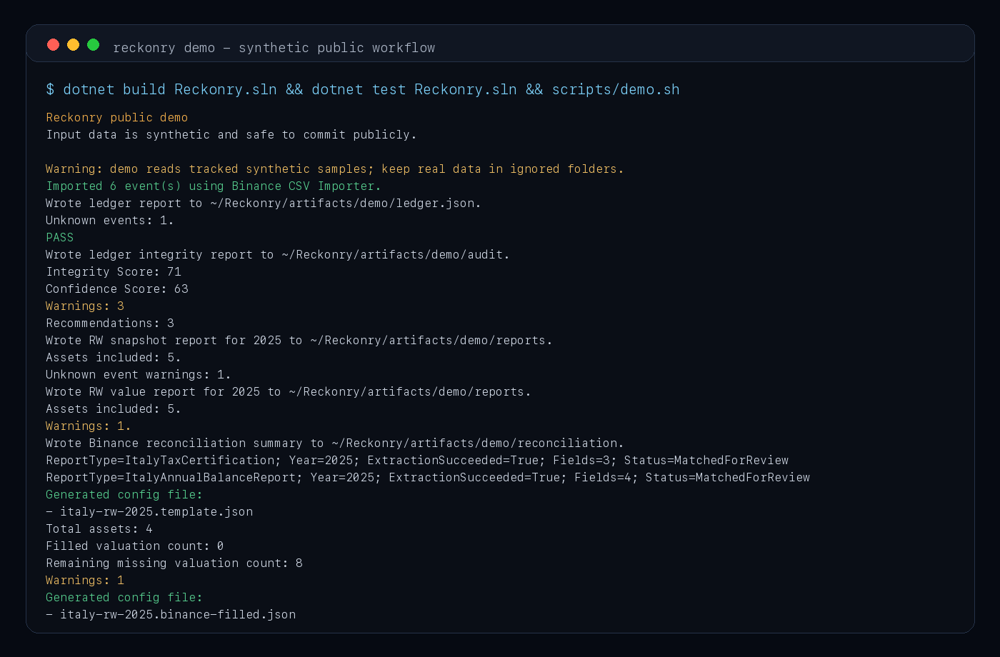
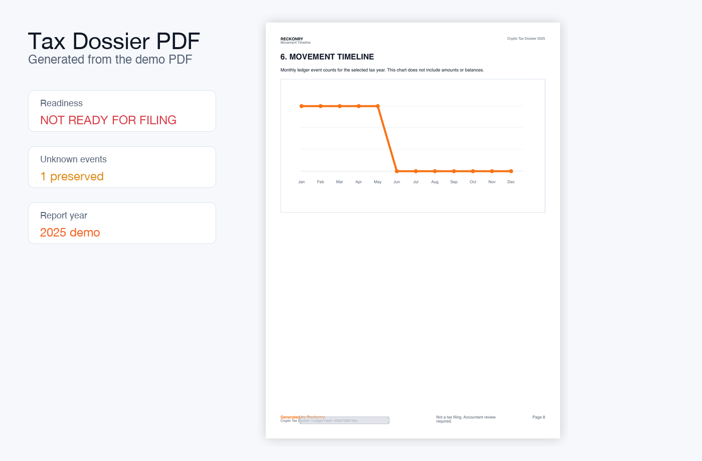
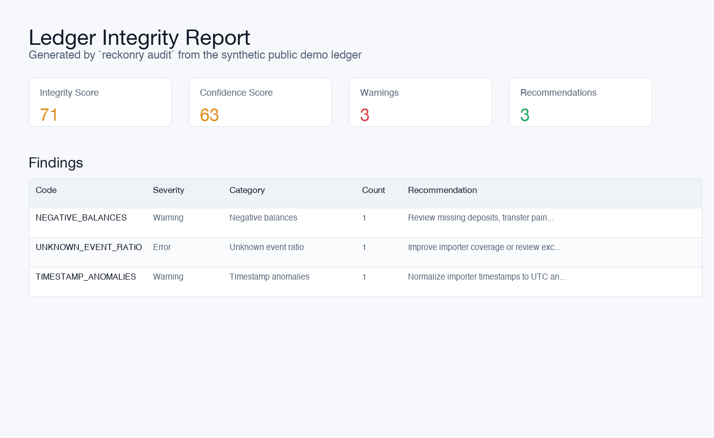
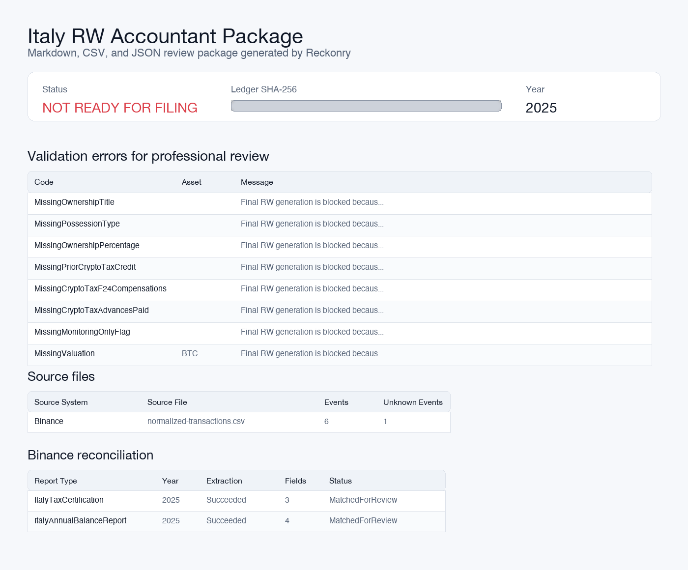
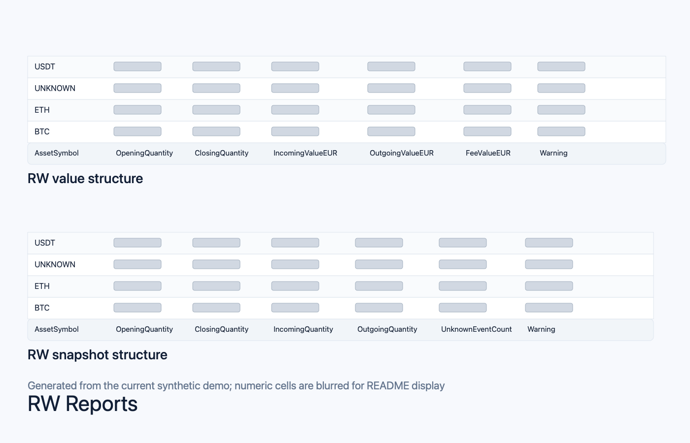
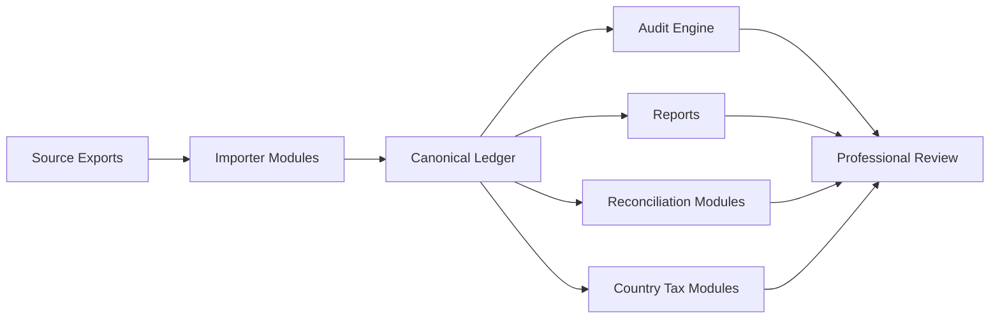

<div align="center">

# Reckonry

### Build. Verify. Review.

**Open-source infrastructure for reviewable financial ledger artifacts.**

*Reconstruct. Normalize. Audit. Reconcile. Report.*

<br>


<br>

> **Evidence-based financial ledger reconstruction for review.**

</div>

Reckonry imports fragmented digital asset source data, preserves evidence, reconstructs a canonical ledger, and generates reproducible review artifacts for accountants, auditors, developers, and finance teams.

Reckonry does not calculate taxes. It builds reproducible, explainable artifacts for professional review.

Every imported byte must remain traceable. Every generated number must be explainable. Unknown data is preserved instead of hidden. The ledger is the single source of truth.

## Quickstart

Run the full public demo with synthetic data:

```bash
dotnet build Reckonry.sln
dotnet test Reckonry.sln
scripts/demo.sh
```

On Windows PowerShell:

```powershell
dotnet build Reckonry.sln
dotnet test Reckonry.sln
./scripts/demo.ps1
```

The demo reads fake inputs from [samples/demo](samples/demo/README.md) and writes generated outputs to ignored local files under `artifacts/demo/`, including `ledger.json`, audit reports, a provider/country reconciliation summary, an Italy country-module accountant package, and a professional-review dossier PDF.

See [docs/quickstart.md](docs/quickstart.md) for the full 10-minute walkthrough.

## Why Reckonry Exists

Digital asset accounting breaks when source data is treated as disposable. Exchanges change schemas, split activity across products, rename operations, and export files that are hard to reconcile months later.

Reckonry treats source evidence as part of the system, not a temporary import detail. Importers produce canonical ledger events. Reports, reconciliation tools, and future tax modules consume the ledger without modifying it.

## Core Principles

<table>
  <tr>
    <td><strong>Never invent financial data</strong><br>Missing values remain missing until supported by evidence.</td>
    <td><strong>Preserve every source</strong><br>Rows, files, and source references remain traceable.</td>
  </tr>
  <tr>
    <td><strong>Make every number explainable</strong><br>Reports must be reproducible from the ledger.</td>
    <td><strong>Ledger first</strong><br>Tax modules interpret the ledger. They never modify it.</td>
  </tr>
</table>

See [docs/philosophy.md](docs/philosophy.md), [docs/engineering/principles.md](docs/engineering/principles.md), and [docs/development/definition-of-done.md](docs/development/definition-of-done.md).

## Product Screenshots

These images are generated from the public demo workflow using synthetic data. Sensitive-looking values such as hashes and report values are blurred where appropriate. The current public demo uses Binance Italy as one complete provider/country workflow; it is not the full product scope.

Screenshot regeneration and redaction rules are documented in [assets/showcase](assets/showcase/README.md).

<div align="center">
  
  <p><sub>CLI demo run: import, validate, audit, reconcile, generate Italy RW outputs, and produce a Tax Dossier PDF.</sub></p>
</div>

<div align="center">
  
  <p><sub>Tax Dossier PDF: generated by Reckonry from the demo ledger and accountant review inputs.</sub></p>
</div>

<div align="center">
  
  <p><sub>Audit report: integrity score, confidence score, warnings, and review recommendations from the generated ledger.</sub></p>
</div>

<div align="center">
  
  <p><sub>Accountant package: Italy RW professional review summary with validation status, source files, and reconciliation metadata.</sub></p>
</div>

<div align="center">
  
  <p><sub>RW reports: generated snapshot and value table structures with numeric cells blurred for public display.</sub></p>
</div>

## Product Surface

<table>
  <tr>
    <td><strong>Canonical Ledger</strong><br>Source-preserving digital asset event model.</td>
    <td><strong>Importer Modules</strong><br>Provider-specific parsing behind source contracts.</td>
    <td><strong>Audit Reports</strong><br>Integrity checks, warnings, and reproducible evidence.</td>
  </tr>
  <tr>
    <td><strong>Reconciliation</strong><br>Compare Reckonry outputs against official reports.</td>
    <td><strong>Professional Dossier</strong><br>Review package, not a filing engine.</td>
    <td><strong>SDK Architecture</strong><br>Importer, report, reconciliation, and tax extension points.</td>
  </tr>
</table>

## Architecture



Project boundaries:

- `Reckonry.Core` contains canonical ledger models and never references importers or tax modules.
- Importers produce ledger events.
- Reports consume ledger events.
- Reconciliation is read-only.
- Tax modules consume the ledger only.
- Bundled Reckonry modules are discovered automatically by host applications.
- Decimal arithmetic is used for financial and digital asset quantities.

The canonical architecture overview is [docs/architecture](docs/architecture/README.md).
Architecture decisions are tracked in [docs/adr](docs/adr/README.md).

## Canonical Ledger

Reckonry writes `ledger.json` using the Reckonry canonical ledger v1 format.

- Specification: [docs/specifications/reckonry-ledger-v1.md](docs/specifications/reckonry-ledger-v1.md)
- JSON schema: [reckonry.schema.json](reckonry.schema.json)
- Schema version: `reckonry-ledger-v1`

The CLI validator prints `Validation passed: <ledger.json>` for valid canonical ledgers or a list of validation errors.

## CLI

```bash
reckonry plugins
```

```bash
reckonry import binance --input ./input/binance --out ./output/ledger.json
```

```bash
reckonry validate --input ./output/ledger.json
```

```bash
reckonry report integrity --input ./output/ledger.json --out ./output/audit
```

```bash
reckonry tax italy rw snapshot --input ./output/ledger.json --year 2025 --out ./output/reports
```

```bash
reckonry tax italy accountant --input ./output/ledger.json --year 2025 --out ./output/accountant --language it-IT
```

```bash
reckonry tax italy dossier --year 2025 --ledger ./output/ledger.json --handoff ./output/accountant/accountant-handoff-2025.json --rw ./output/accountant/italy-rw-accountant-2025.json --out ./output/accountant --language en-US
```

Italy RW accountant and Tax Dossier reports support `it-IT` and `en-US`. Italy RW outputs default to `it-IT`. Legal field codes such as `RW`, `RW8`, `IC`, `IVAFE`, and `IVIE`, asset symbols, hashes, and source file names are not translated.

## Tax Dossier

The Tax Dossier is a professional review PDF for accountants, auditors, and tax professionals.

It includes:

- Cover page and verification QR code.
- Ledger integrity summary.
- Reconciliation status.
- Source document summary.
- Portfolio composition chart based only on available valuation evidence.
- Movement timeline using monthly event counts only.
- RW/RW8 draft sections.
- Validation errors and missing inputs.
- Professional checklist.
- Technical appendix with hashes, version, commit, and aggregate counts.

The Tax Dossier is not a tax filing and does not provide tax, legal, accounting, or financial advice.

## Verification & Reconciliation

Reckonry can compare internally reconstructed reports against official provider-issued reports for validation. Reconciliation never replaces the ledger and never changes ledger events.

```bash
reckonry reconcile binance italy --reports ./input/binance --ledger-reports ./output/reports --out ./output/reconciliation
```

The current demo installs one provider/country reconciliation module for Binance Italy documents and one provider-level Coinbase reconciliation module for synthetic aggregate statement metadata. The Binance Italy module reads text-based Tax Certification PDFs and Annual Balance Report PDFs when text can be extracted directly. Image-only PDFs are detected and reported as requiring OCR.

## Bundled Module Discovery

Reckonry is designed for source-independent and country-independent growth. Current hosts discover bundled Reckonry assemblies and expose their descriptors.

| Area | Contract | Purpose |
| --- | --- | --- |
| Importers | `ISourceImporter` | Convert source exports into canonical ledger events. |
| Reports | `IReportModule` | Advertise generic, country, provider, and professional report artifacts. |
| Reconciliation | `IReconciliationModule` | Compare ledger outputs with external official reports. |
| Tax | `ITaxModule` | Interpret the ledger without modifying it. |
| Pricing | Pricing abstractions | Future evidence-backed market data integrations. |

SDK design notes live in [docs/sdk](docs/sdk/README.md).

## Plugin SDK Templates

Reckonry includes alpha `dotnet new` templates for external module development:

```bash
dotnet new install ./templates
dotnet new reckonry-importer -n Contoso.Reckonry.Importers.Example
dotnet test Contoso.Reckonry.Importers.Example/tests/Contoso.Reckonry.Importers.Example.Tests/Contoso.Reckonry.Importers.Example.Tests.csproj -p:ReckonryRoot=$(pwd)
```

Available templates:

- `reckonry-importer`
- `reckonry-tax-module`
- `reckonry-report`
- `reckonry-reconciliation`

See [docs/sdk/plugin-template.md](docs/sdk/plugin-template.md) for the full
template guide and “Build your first importer” tutorial.

## Importer Status

| Importer | Module Id | Status | Version | Public alpha scope |
| --- | --- | --- | --- | --- |
| Binance | `binance` | Alpha implementation | `0.1.0` | Synthetic demo workflow and selected CSV fixtures |
| Coinbase | `coinbase` | Alpha implementation | `0.1.0-alpha` | Synthetic demo workflow and selected CSV fixtures |

Additional source importer projects exist as internal placeholders and are not supported importer implementations yet.

Unsupported rows are intentionally preserved as unknown ledger events instead of being discarded.

## Experimental API Host

`Reckonry.Api` is an experimental in-memory host for exercising descriptors and basic workflows during development. It has no authentication, no database, no persistence, and no production hardening. It is not a deployable product API and should not be treated as a stable public contract.

```bash
dotnet run --project src/Reckonry.Api/Reckonry.Api.csproj
```

Current diagnostic endpoints:

- `POST /import`
- `POST /audit`
- `GET /plugins`
- `GET /reports`
- `POST /reports`
- `POST /reconcile`
- `GET /importers`
- `GET /swagger/v1/swagger.json` development metadata only; not generated OpenAPI and not contract-tested

## Roadmap

See [ROADMAP.md](ROADMAP.md) for planned milestones from `v0.1.0-alpha` through `v1.0.0`.

## Brand and Design

- Brand guidelines: [docs/branding](docs/branding/README.md)
- Design system: [docs/design-system.md](docs/design-system.md)
- Visual assets: [assets](assets/README.md)

## Privacy

Real source exports, generated ledgers, generated reports, and private tax configuration must stay under ignored local folders such as `input/` and `output/`.

See [docs/privacy.md](docs/privacy.md).

## Disclaimer

Reckonry is not tax, legal, accounting, or financial advice.

Public alpha limitations:

- Reckonry is not a tax calculator or filing product.
- Current importer coverage is incomplete.
- The public demo proves one synthetic workflow, not full real-world coverage.
- Tax Dossier and Italy RW outputs are professional review aids only.
- `Reckonry.Api` is experimental and is not a supported public alpha surface.
- Users must validate results with qualified professionals before relying on them.

Reckonry does not guarantee correctness of tax reports, accounting outputs, classifications, or generated ledgers. Users are responsible for validating all results with qualified professionals before relying on them.

Authors and contributors accept no liability for tax, legal, financial, accounting, reporting, or compliance consequences arising from the use of Reckonry.

## Licensing

Reckonry is available for open-source use under the GNU Affero General Public License v3. See [LICENSE](LICENSE).

Commercial licensing terms are not currently published in this repository.

See [COMMERCIAL-LICENSE.md](COMMERCIAL-LICENSE.md).

## Contributing

Contributions are welcome while the project is early.

Before opening a PR:

- Read [docs/development/definition-of-done.md](docs/development/definition-of-done.md).
- Keep tax interpretation out of `Reckonry.Core`.
- Use `decimal`, never `double`, for financial and digital asset amounts.
- Add fake/anonymized tests only.
- Do not commit real financial data.
- Update docs and ADRs when behavior or architecture changes.

See [CONTRIBUTING.md](CONTRIBUTING.md), [GOVERNANCE.md](GOVERNANCE.md), and [CHANGELOG.md](CHANGELOG.md).

## Security

Responsible disclosure guidance is documented in [SECURITY.md](SECURITY.md).

## Project Governance

- Roadmap: [ROADMAP.md](ROADMAP.md)
- Contributing: [CONTRIBUTING.md](CONTRIBUTING.md)
- Security: [SECURITY.md](SECURITY.md)
- Governance: [GOVERNANCE.md](GOVERNANCE.md)
- Changelog: [CHANGELOG.md](CHANGELOG.md)
