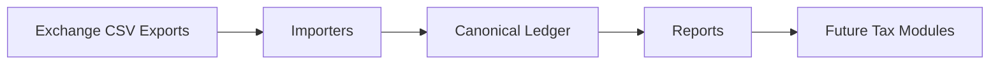

<div align="center">
  

  <h1>LedgerForge</h1>

  <p><strong>Build a verifiable crypto ledger from messy exchange exports.</strong></p>

  <p>
    <strong>.NET</strong> ·
    <strong>C#</strong> ·
    <strong>License: AGPL-3.0</strong> ·
    <strong>Architecture: Clean Architecture</strong> ·
    <strong>Status: Early Alpha</strong> ·
    <strong>Tax Advice: No</strong>
  </p>
</div>

## What Is LedgerForge?

LedgerForge is an open-source crypto ledger engine for importing exchange data, reconstructing transaction history, and generating auditable reports for accounting and tax workflows.

It is built around a canonical ledger model that preserves source evidence, records unknown rows explicitly, and keeps tax interpretation separate from raw transaction reconstruction.

## Why LedgerForge?

Crypto exports are messy. Exchanges use different CSV formats, rename fields, omit context, split related activity across files, and change schemas over time. LedgerForge exists to forge that raw data into a clean, reviewable ledger without hiding uncertainty.

The project is developer-focused infrastructure: import the data, preserve the evidence, normalize the events, report the exceptions, and leave jurisdiction-specific tax interpretation to explicit future modules.

## Key Features

- Import exchange CSV exports.
- Normalize transactions into a canonical ledger.
- Preserve source rows and unknown data.
- Generate auditable reports.
- Extensible importer architecture.
- Future country-specific tax modules outside Core.
- Decimal-first amount handling for financial and crypto values.
- Clean Architecture-oriented project boundaries.

## Architecture Overview



Importers convert exchange-specific exports into canonical ledger events while preserving original source rows through `SourceReference`. Reports consume the canonical ledger and produce reviewable outputs such as `ledger.json` and exception files.

Tax modules are planned as future components outside `LedgerForge.Core`, so the core ledger remains factual, portable, and free of country-specific tax rules.

## CLI Quick Start

```bash
ledgerforge import binance --input ./exports/binance --out ./ledger.json
```

```bash
ledgerforge validate --input ./ledger.json
```

```bash
ledgerforge report rw-snapshot --input ./ledger.json --year 2025 --out ./reports
```

The RW snapshot command writes:

- `rw-snapshot-2025.csv`
- `rw-snapshot-2025.json`

The current CLI is early and intentionally minimal. RW snapshot reports are quantity-only yearly balance snapshots and do not calculate capital gains, tax due, LIFO/FIFO lots, or tax advice.

## Verification & Reconciliation

LedgerForge can compare its internally reconstructed ledger reports against official exchange-issued reports for validation.

For Binance Italy documents, the reconciliation module reads official Tax Certification PDFs and Annual Balance Report PDFs when text can be extracted directly from the PDF. If a document is image-only, LedgerForge marks it as requiring OCR and does not attempt OCR automatically.

Reconciliation is validation-only. It never replaces the canonical ledger, never performs tax advice, and never changes ledger events. Generated reconciliation summaries are intended to highlight extraction status, report type, year, field counts, and whether LedgerForge reports are present for review.

```bash
ledgerforge reconcile binance --reports ./input/binance --ledger-reports ./output/reports --out ./output/reconciliation
```

## Supported Importers

| Importer | Status |
| --- | --- |
| Binance | Early: deposits, withdrawals, spot trades, conversions, rewards, unknown-row fallback |
| Revolut | Planned |
| Coinbase | Planned |
| Kraken | Planned |

### Binance Importer Status

The Binance importer currently handles fake/sample CSV exports that resemble common Binance transaction history and trade export shapes:

- Universal transaction rows with `UTC_Time`, `Account`, `Operation`, `Coin`, `Change`, and `Remark`.
- Deposits and withdrawals from transaction-history rows.
- Earn, staking, interest, and reward-style rows when recognizable from `Operation`.
- Spot trade rows with `Date(UTC)`, `Market`, `Type`, `Amount`, `Total`, `Fee`, and `Fee Coin`.
- Conversion rows with `From Asset`, `From Amount`, `To Asset`, and `To Amount`.
- Unknown rows as `LedgerEventType.Unknown`, preserving source file, row number, and raw row data for `exceptions.csv`.

Real Binance exports vary by product, account type, locale, and export version. Unsupported rows are intentionally preserved instead of discarded.

## Roadmap

- Expand Binance CSV coverage for additional real export variants.
- Add importer diagnostics for unsupported rows and ambiguous records.
- Add Revolut, Coinbase, and Kraken importers.
- Stabilize the canonical ledger JSON schema.
- Add richer validation and reconciliation checks.
- Generate summary and exception reports for accounting review.
- Design future country-specific tax modules outside Core.
- Publish sanitized sample datasets and importer fixtures.

## Disclaimer

LedgerForge is not tax, legal, accounting, or financial advice.

LedgerForge does not guarantee correctness of tax reports, accounting outputs, classifications, or generated ledgers. Users are responsible for validating all results with qualified professionals before relying on them.

Authors and contributors accept no liability for tax, legal, financial, accounting, reporting, or compliance consequences arising from the use of LedgerForge.

## Licensing

LedgerForge is available for open-source use under the GNU Affero General Public License v3. See [LICENSE](LICENSE).

Commercial licensing is available for proprietary integrations or use cases where AGPL obligations are not acceptable. For commercial licensing inquiries, contact `licensing@example.com`.

See [COMMERCIAL-LICENSE.md](COMMERCIAL-LICENSE.md).

## Contributing

Contributions are welcome while the project is early. The core rules are:

- Do not add tax interpretation to `LedgerForge.Core`.
- Use `decimal` for financial and crypto amounts.
- Preserve source rows and raw source data.
- Represent unsupported rows as `LedgerEventType.Unknown`.
- Add tests for behavior changes.

See [CONTRIBUTING.md](CONTRIBUTING.md).

## Security

LedgerForge is early-stage software and does not yet have a dedicated security response process. Please report suspected vulnerabilities privately to the maintainers rather than opening public issues.

See [SECURITY.md](SECURITY.md).
