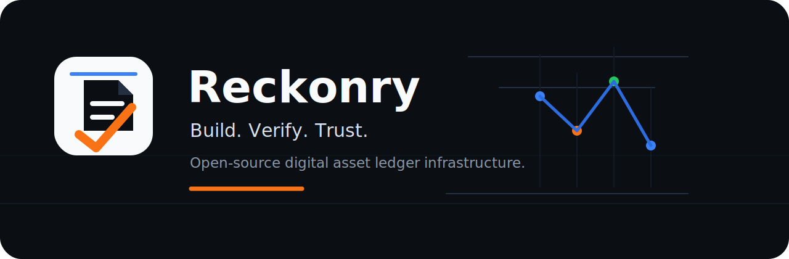
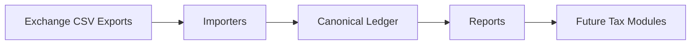

<div align="center">
  

  <h1>LedgerForge</h1>

  <p><strong>Build a verifiable crypto ledger from messy exchange exports.</strong></p>

  <p>
    <strong>.NET</strong> ·
    <strong>C#</strong> ·
    <strong>License: AGPL-3.0</strong> ·
    <strong>Architecture: Clean Architecture</strong> ·
    <strong>Status: Early Alpha</strong> ·
    <strong>Tax Advice: No</strong>
  </p>
</div>

## What Is LedgerForge?

LedgerForge is an open-source crypto ledger engine for importing exchange data, reconstructing transaction history, and generating auditable reports for accounting and tax workflows.

It is built around a canonical ledger model that preserves source evidence, records unknown rows explicitly, and keeps tax interpretation separate from raw transaction reconstruction.

LedgerForge follows a strict transparency philosophy: never invent financial data, never hide unknown information, keep every imported byte traceable, make every generated number explainable, and treat the Ledger as the only source of truth. See [docs/philosophy.md](docs/philosophy.md) and [docs/engineering/principles.md](docs/engineering/principles.md).

Versioning follows Semantic Versioning with explicit compatibility rules for canonical schemas, JSON, importers, CLI commands, and future plugins. See [docs/versioning.md](docs/versioning.md).

The planned third-party SDK architecture is documented in [docs/sdk](docs/sdk/README.md), covering importer, tax, report, and reconciliation plugins.

The long-term engineering vision is documented in [docs/VISION.md](docs/VISION.md).

## Why LedgerForge?

Crypto exports are messy. Exchanges use different CSV formats, rename fields, omit context, split related activity across files, and change schemas over time. LedgerForge exists to forge that raw data into a clean, reviewable ledger without hiding uncertainty.

The project is developer-focused infrastructure: import the data, preserve the evidence, normalize the events, report the exceptions, and leave jurisdiction-specific tax interpretation to explicit future modules.

## Key Features

- Import exchange exports through exchange-specific plugins.
- Normalize transactions into a canonical ledger.
- Preserve source rows and unknown data.
- Generate auditable reports.
- Plugin-ready importer architecture with registry/factory discovery.
- Future country-specific tax modules outside Core.
- Decimal-first amount handling for financial and crypto values.
- Clean Architecture-oriented project boundaries.

## Architecture Overview



Importers are exchange-specific plugins that convert exports into canonical ledger events while preserving original source rows through `SourceReference`. Reports consume the canonical ledger and produce reviewable outputs such as `ledger.json` and exception files.

Tax modules are planned as future components outside `LedgerForge.Core`, so the core ledger remains factual, portable, and free of country-specific tax rules.

## Canonical Ledger Format

LedgerForge writes `ledger.json` using the LedgerForge canonical ledger v1 format.

- Specification: [docs/specifications/ledgerforge-ledger-v1.md](docs/specifications/ledgerforge-ledger-v1.md)
- JSON schema: [ledgerforge.schema.json](ledgerforge.schema.json)
- Schema version: `ledgerforge-ledger-v1`

Generated ledgers are validated before they are written successfully. The CLI validator returns `PASS` for valid canonical ledgers or a list of validation errors.

## Architecture Decisions

LedgerForge records major architectural decisions as ADRs in [docs/adr](docs/adr/README.md). These decisions define the project boundaries around the canonical ledger, importer behavior, report immutability, reconciliation, tax modules, decimal arithmetic, and financial estimation.

## CLI Quick Start

```bash
ledgerforge importers
```

```bash
ledgerforge import binance --input ./exports/binance --out ./ledger.json
```

```bash
ledgerforge validate --input ./ledger.json
```

Expected validation output:

```text
PASS
```

```bash
ledgerforge config italy-rw-template --year 2025 --ledger ./output/ledger.json --out ./input/italy-rw/italy-rw-2025.json
```

```bash
ledgerforge config italy-rw-fill-binance --config ./input/italy-rw/italy-rw-2025.json --reconciliation ./output/reconciliation/reconciliation-summary.json --out ./input/italy-rw/italy-rw-2025.binance-filled.json
```

```bash
ledgerforge report rw-snapshot --input ./ledger.json --year 2025 --out ./reports
```

```bash
ledgerforge report italy-rw-accountant --input ./output/ledger.json --year 2025 --out ./output/accountant
```

The RW snapshot command writes:

- `rw-snapshot-2025.csv`
- `rw-snapshot-2025.json`

The Italy RW accountant command writes a professional review package:

- `italy-rw-accountant-2025.md`
- `italy-rw-accountant-2025.csv`
- `italy-rw-accountant-2025.json`

The Italy RW config commands generate private ignored configuration files with taxpayer placeholders and per-asset valuation evidence placeholders. Binance fill is conservative: it only fills values when official Binance report data is available and unambiguous.

The current CLI is early and intentionally minimal. RW snapshot reports are quantity-only yearly balance snapshots. The Italy RW accountant package is a draft review package and is marked `NOT READY FOR FILING` when taxpayer configuration, valuation evidence, or other required inputs are missing. LedgerForge does not calculate capital gains, LIFO/FIFO lots, final filing advice, or tax advice.

## Italy RW Official Model

`LedgerForge.Tax.Italy` includes a draft official Quadro RW model for crypto-assets based on the local Agenzia Entrate analysis in [docs/analysis/quadro-rw-analysis.md](docs/analysis/quadro-rw-analysis.md).

The model covers RW1-RW5 crypto lines, RW8 crypto-assets tax summary fields, taxpayer/report configuration, valuation evidence, and validation messages. It generates draft crypto lines only:

- RW column 3 is fixed to code `21` for configured crypto-assets.
- IVIE and IVAFE columns are not populated for crypto lines.
- Missing ownership, missing valuation evidence, or unknown events that may affect balances block finalization.
- Ambiguous foreign-state treatment emits a warning.

This is not final tax advice and does not implement capital gains, LIFO/FIFO, RT reporting, or filing recommendations. See [docs/tax/italy-rw-official-model.md](docs/tax/italy-rw-official-model.md).

## API Preview

`LedgerForge.Api` is a Minimal API architecture preview for in-memory workflows. It has no authentication, no database, and no persistent storage.

Endpoints:

- `POST /import`
- `POST /audit`
- `POST /reports`
- `POST /reconcile`
- `GET /importers`
- `GET /swagger/v1/swagger.json`

Run locally:

```bash
dotnet run --project src/LedgerForge.Api/LedgerForge.Api.csproj
```

The API is not a production host yet. It exists to define the service boundary for future hosted workflows.

## Verification & Reconciliation

LedgerForge can compare its internally reconstructed ledger reports against official exchange-issued reports for validation.

For Binance Italy documents, the reconciliation module reads official Tax Certification PDFs and Annual Balance Report PDFs when text can be extracted directly from the PDF. If a document is image-only, LedgerForge marks it as requiring OCR and does not attempt OCR automatically.

Reconciliation is validation-only. It never replaces the canonical ledger, never performs tax advice, and never changes ledger events. Generated reconciliation summaries are intended to highlight extraction status, report type, year, field counts, and whether LedgerForge reports are present for review.

```bash
ledgerforge reconcile binance --reports ./input/binance --ledger-reports ./output/reports --out ./output/reconciliation
```

## Supported Importers

LedgerForge uses a generic importer framework:

- `IExchangeImporter` is the plugin contract.
- `ImporterDescriptor` exposes supported files, schemas, operations, version, and coverage.
- `ImporterRegistry` discovers importers from the injected importer collection.
- `IImporterFactory` resolves importers by exchange id/name for the CLI and future hosts.

| Importer | Plugin Id | Status | Version | Coverage |
| --- | --- | --- | --- | ---: |
| Binance | `binance` | Early implementation | `0.1.0` | 70% |
| Coinbase | `coinbase` | Placeholder plugin | `0.0.0-placeholder` | 0% |
| Kraken | `kraken` | Placeholder plugin | `0.0.0-placeholder` | 0% |
| Revolut | `revolut` | Placeholder plugin | `0.0.0-placeholder` | 0% |
| Crypto.com | `crypto.com` | Placeholder plugin | `0.0.0-placeholder` | 0% |
| Bitstamp | `bitstamp` | Placeholder plugin | `0.0.0-placeholder` | 0% |

Placeholder plugins expose metadata and reserve architecture boundaries, but intentionally return a clear "not implemented" message if invoked.

### Binance Importer Status

The Binance importer currently handles fake/sample CSV exports that resemble common Binance transaction history and trade export shapes:

- Universal transaction rows with `UTC_Time`, `Account`, `Operation`, `Coin`, `Change`, and `Remark`.
- Deposits and withdrawals from transaction-history rows.
- Earn, staking, interest, and reward-style rows when recognizable from `Operation`.
- Spot trade rows with `Date(UTC)`, `Market`, `Type`, `Amount`, `Total`, `Fee`, and `Fee Coin`.
- Conversion rows with `From Asset`, `From Amount`, `To Asset`, and `To Amount`.
- Unknown rows as `LedgerEventType.Unknown`, preserving source file, row number, and raw row data for `exceptions.csv`.

Real Binance exports vary by product, account type, locale, and export version. Unsupported rows are intentionally preserved instead of discarded.

## Roadmap

- Expand Binance CSV coverage for additional real export variants.
- Add importer diagnostics for unsupported rows and ambiguous records.
- Implement Coinbase, Kraken, Revolut, Crypto.com, and Bitstamp importer plugins.
- Add dynamic external plugin loading beyond built-in importer registration.
- Stabilize the canonical ledger JSON schema.
- Add richer validation and reconciliation checks.
- Generate summary and exception reports for accounting review.
- Design future country-specific tax modules outside Core.
- Publish sanitized sample datasets and importer fixtures.

## Disclaimer

LedgerForge is not tax, legal, accounting, or financial advice.

LedgerForge does not guarantee correctness of tax reports, accounting outputs, classifications, or generated ledgers. Users are responsible for validating all results with qualified professionals before relying on them.

Authors and contributors accept no liability for tax, legal, financial, accounting, reporting, or compliance consequences arising from the use of LedgerForge.

## Licensing

LedgerForge is available for open-source use under the GNU Affero General Public License v3. See [LICENSE](LICENSE).

Commercial licensing is available for proprietary integrations or use cases where AGPL obligations are not acceptable. For commercial licensing inquiries, contact `licensing@example.com`.

See [COMMERCIAL-LICENSE.md](COMMERCIAL-LICENSE.md).

## Contributing

Contributions are welcome while the project is early. The core rules are:

- Do not add tax interpretation to `LedgerForge.Core`.
- Use `decimal` for financial and crypto amounts.
- Preserve source rows and raw source data.
- Represent unsupported rows as `LedgerEventType.Unknown`.
- Add tests for behavior changes.

See [CONTRIBUTING.md](CONTRIBUTING.md).

## Security

LedgerForge is early-stage software and does not yet have a dedicated security response process. Please report suspected vulnerabilities privately to the maintainers rather than opening public issues.

See [SECURITY.md](SECURITY.md).
